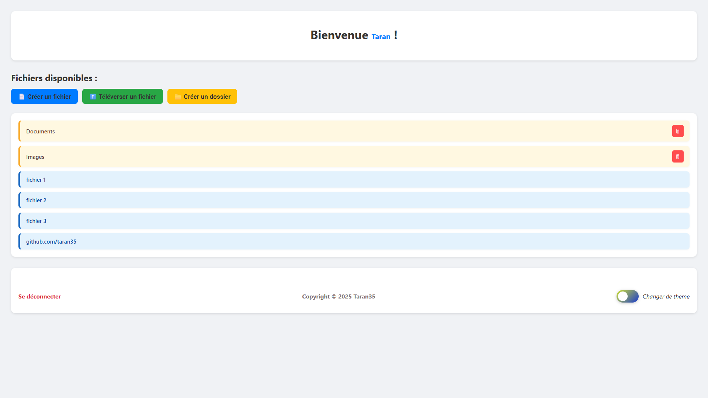
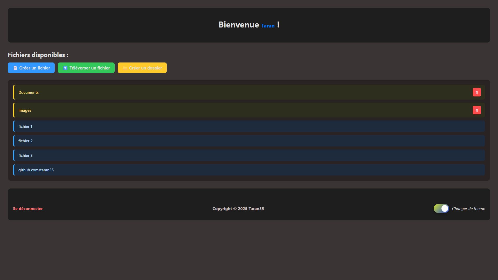
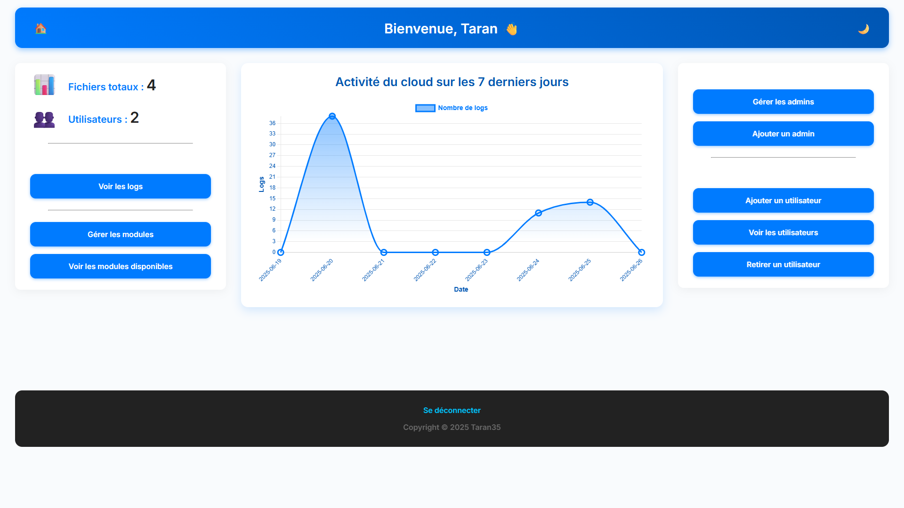
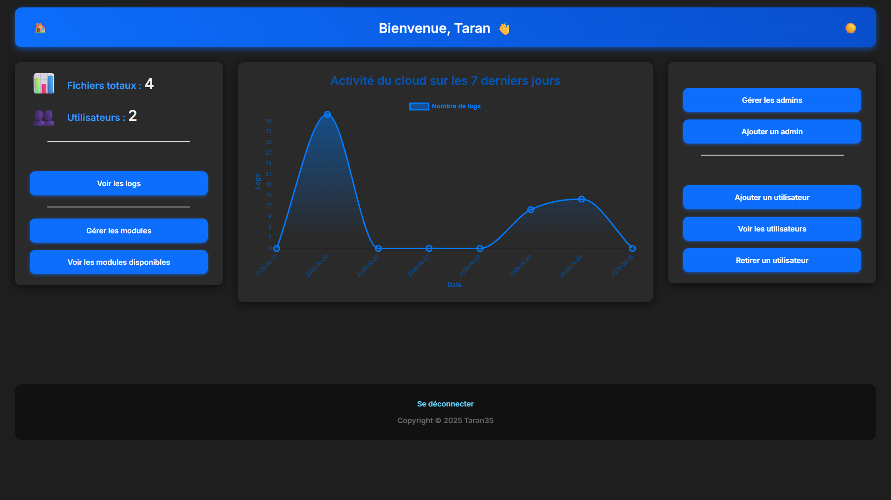

> ⚠️ Fonction de récupération de mot de passe non fonctionnelle

# ☁️ Simple Cloud System — Gestion de fichiers en ligne avec PHP & MySQL

## 📝 Description

Ce projet est un système de cloud web simple utilisant **PHP** et une base de données **MySQL** pour stocker et gérer des fichiers. Il permet à des utilisateurs de **téléverser, consulter et organiser** leurs fichiers via une interface.

---

## 📚 Sommaire

- [⚙️ Prérequis](#️-prérequis)
- [🚀 Installation](#-installation)
- [💡 Utilisation](#-utilisation)
- [🖥️ Visuels](#-visuels)
- [🤝 Contribution](#-contribution)
- [📬 Contact](#-contact)
- [📄 Licence](#-licence)

---

## ⚙️ Prérequis

- 🖥️ Un serveur web compatible avec PHP (Apache, Nginx, etc.)
- 💾 Une base de données **MySQL**

---

## 🚀 Installation

### 1️⃣ Création de la base de données

Exécute les commandes SQL présentes dans le fichier [`bdd_setup.txt`](bdd_setup.txt) sur ta base **MySQL** pour créer les tables nécessaires.
### 2️⃣ Connecte ta base de données
  > Défini tes informations de connection dans le fichier [`bdd.php`](account/bdd.php) pour les utilisateurs et dans [`fbdd.php`](main/fbdd.php) pour les fichiers (possibilité de mettre la même)
### 3️⃣ Création du premier utilisateur administrateur

1. Ouvre le fichier [`create_first_admin.php`](create_first_admin.php) dans un navigateur web.
2. Remplis le formulaire :
   - 👤 **Pseudo** : au moins 4 caractères
   - 📧 **Adresse mail** : valide
   - 🔑 **Mot de passe** : au moins 8 caractères
3. Deux requêtes SQL s’afficheront à l’écran.
4. Exécute-les dans ta base de données pour créer ton premier compte admin.

> ⚠️ **Important** : pense à **supprimer** les fichiers `create_first_admin.php` et `bdd.txt` après création du compte et de la base de données pour des raisons de sécurité.

### 4️⃣ Paramètrage des pages d'erreurs personalisées
 - **Apache :** insérer dans un fichier `.htaccess` à la racine du site ces lignes et fais tes pages d'erreurs personnalisées:
 ```text
    ErrorDocument 404 erreurs/404.html
    ErrorDocument 403 erreurs/403.html
     ErrorDocument 503 erreurs/503.html
 ...
 ```
 - **Nginx :** insérer dans le fichier `nginx.conf` ces lignes et fais tes pages d'erreurs personnalisées:
 ```text
    error_page 404 /erreurs/404.html;
    error_page 403 /erreurs/403.html;
    error_page 503 /erreurs/503.html;

    location = /erreurs/404.html {
        internal;
    }
    location = /erreurs/403.html {
        internal;
    }
    location = /erreurs/503.html {
        internal;
    }
...
 ```
  Il ne reste plus qu'à redémarrer votre serveur !
---

## 💡 Utilisation

Une fois la base de données configurée et l’administrateur créé, le système est prêt à être utilisé !

Connecte-toi avec ton compte admin pour commencer à :
- Gérer les fichiers
- Gérer les utilisateurs
- Suivre l'activité du cloud

> ⚠️ **Information** : La base de données permet de stocker des fichiers jusqu'à 10.000 caractères, pour modifier cette limite:
1. Initialiser la base de données **files** en modifiant cette ligne `content VARCHAR(VALEUR_VOULU),` et modifier le fichier [`cloud_script.js`](cloud_script.js) à la ligne 411 `if (Pcontent.length < VALEUR_VOULU) {`
---

## 🖥️ Visuels

> **Panel utilisateur :**



> **Panel administrateur :**


---
## 🤝 Contribution

Les contributions sont les bienvenues !  
Tu peux :
- Proposer des **améliorations**
- Signaler des **bugs**
- Ouvrir une **issue** ou une **pull request**
- créer des modules (voir [`ce fichier`](CREATE_MODULE.md) pour en savoir plus)

Merci pour ton aide !

---

## 📬 Contact

Pour toute question ou suggestion, tu peux contacter **[taran35](https://github.com/taran35)** sur GitHub.

---

## 📄 Licence

Ce projet est distribué sous la licence BSD-3-Clause.  
Voir le fichier [LICENSE](LICENSE.txt) pour plus d’informations.
